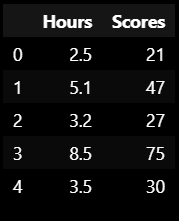
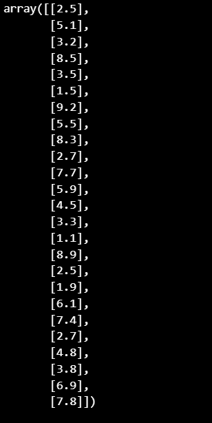
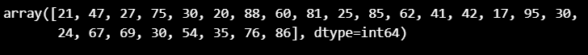
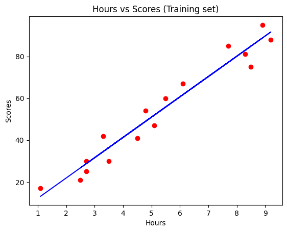
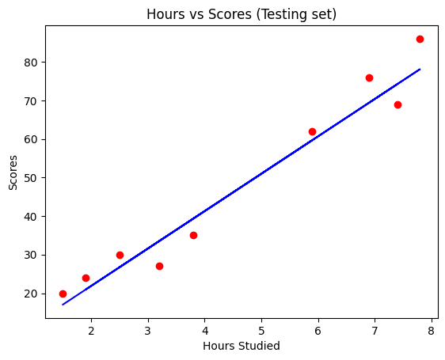
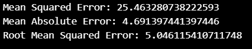

# Implementation-of-Simple-Linear-Regression-Model-for-Predicting-the-Marks-Scored

## AIM:
To write a program to predict the marks scored by a student using the simple linear regression model.

## Equipments Required:
1. Hardware – PCs
2. Anaconda – Python 3.7 Installation / Jupyter notebook

## Algorithm
### 1.Import the standard Libraries. 
### 2.Set variables for assigning dataset values. 
### 3.Import linear regression from sklearn. 
### 4.Assign the points for representing in the graph. 
### 5.Predict the regression for marks by using the representation of the graph. 
### 6.Compare the graphs and hence we obtained the linear regression for the given datas.

## Program:
```
/*
Program to implement the simple linear regression model for predicting the marks scored.
Developed by: Bharath Raj P
RegisterNumber:  212223230031
*/
import pandas as pd
import numpy as np
import matplotlib.pyplot as plt
from sklearn.metrics import mean_absolute_error,mean_squared_error
df = pd.read_csv('student_scores.csv')
df.head()
df.tail()

X = df.iloc[:,:-1].values
X
Y = df.iloc[:,1].values
Y

from sklearn.model_selection import train_test_split
X_train, X_test, Y_train, Y_test = train_test_split(X,Y,test_size=1/3,random_state=0)
from sklearn.linear_model import LinearRegression
regressor = LinearRegression()
regressor.fit(X_train,Y_train)
Y_pred = regressor.predict(X_test)
Y_pred
Y_test

plt.scatter(X_train,Y_train,color='red')
plt.plot(X_train,regressor.predict(X_train),color='blue')
plt.title('Hours vs Scores (Training set)')
plt.xlabel('Hours')
plt.ylabel('Scores')
plt.show()

plt.scatter(X_test,Y_test,color='red')
plt.plot(X_test,regressor.predict(X_test),color='blue')
plt.title('Hours vs Scores (Testing set)')
plt.xlabel('Hours Studied')
plt.ylabel('Scores')
plt.show()

mse = mean_squared_error(Y_test,Y_pred)
print('Mean Squared Error:',mse)

mae = mean_absolute_error(Y_test,Y_pred)
print('Mean Absolute Error:',mae)

rmse = np.sqrt(mse)
print('Root Mean Squared Error:',rmse)

```

## Output:
### Data :


### X and y values:



### Plot:



### ERROR METHOD:



## Result:
Thus the program to implement the simple linear regression model for predicting the marks scored is written and verified using python programming.
